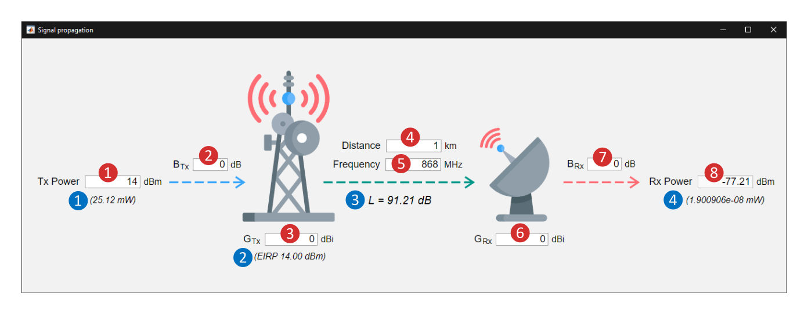

# Signal Propagation

## Main Functionality
The application simulates the propagation of radio signals in line-of-sight conditions in the free space environment. The attenuation of the radio channel is derived based on the free-space path-loss formula. Also, the atmospheric attenuation is omitted to simplify the process of signal propagation understanding for inexperienced users.

### How To Control the Application
The program automatically recalculates the values every time the input parameter (highlighted with red circles) is changed. Nevertheless, the change is not propagated until the **Enter** key is pressed.

#### Input/Output Parameters
The input/output parameters are highlighted by the red color circles with the respective number.

1. Transmitter output power in **dBm**
2. Inserted attenuation of the transmitter signal line (coaxial cables impedance, connectors attenuation)
3. Transmitter antenna gain in **dBi**
4. Distance between transmitter and receiver
5. Carrier fruequency in **MHz**
6. Receiver antenna gain in **dBi**
7. Inserted attenuation of the receiver signal line (coaxial cables impedance, connectors attenuation)
8. Received signal power in **dBm**

#### Coverted values
The converted are highlighted by the blue color circles with the respective number.

1. Transmitter output power in **mW**
2. Equivalent Isotropically Radiated Power (EIRP) of the trnsmitter in **dBm**
3. Radio channel attenuation predicted by the Free-Space path-loss formula in **dB**
4. Received signal power level in **mW**